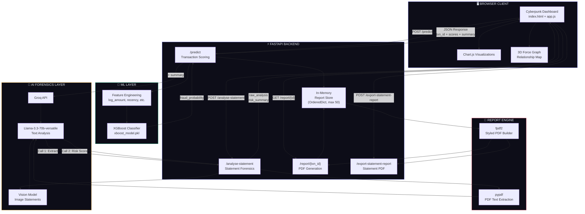
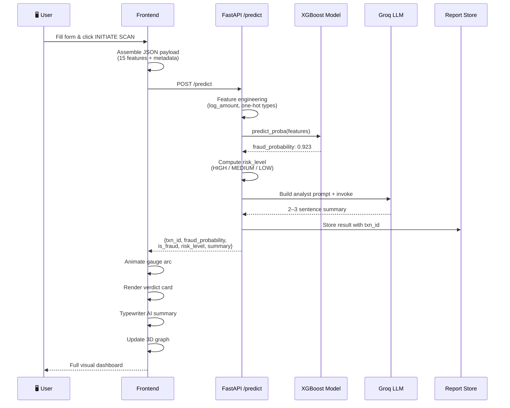
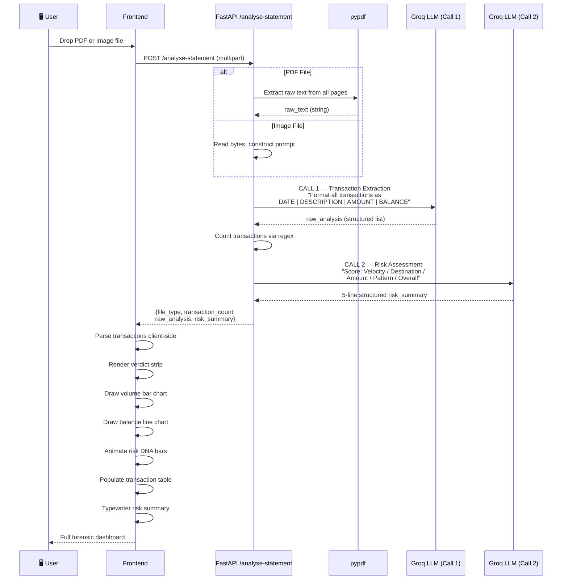

<div align="center">

```
███████╗██████╗  █████╗ ██╗   ██╗██████╗  ██████╗ ██╗   ██╗ █████╗ ██████╗ ██████╗     █████╗ ██╗
██╔════╝██╔══██╗██╔══██╗██║   ██║██╔══██╗██╔════╝ ██║   ██║██╔══██╗██╔══██╗██╔══██╗   ██╔══██╗██║
█████╗  ██████╔╝███████║██║   ██║██║  ██║██║  ███╗██║   ██║███████║██████╔╝██║  ██║   ███████║██║
██╔══╝  ██╔══██╗██╔══██║██║   ██║██║  ██║██║   ██║██║   ██║██╔══██║██╔══██╗██║  ██║   ██╔══██║██║
██║     ██║  ██║██║  ██║╚██████╔╝██████╔╝╚██████╔╝╚██████╔╝██║  ██║██║  ██║██████╔╝   ██║  ██║██║
╚═╝     ╚═╝  ╚═╝╚═╝  ╚═╝ ╚═════╝ ╚═════╝  ╚═════╝  ╚═════╝ ╚═╝  ╚═╝╚═╝  ╚═╝╚═════╝    ╚═╝  ╚═╝╚═╝
```

### `REAL-TIME FINANCIAL FRAUD INTELLIGENCE // POWERED BY XGBOOST + GROQ`

---


---

> **FraudGuard AI** is a high-fidelity, production-grade fraud intelligence platform that fuses classical machine learning with generative AI forensics — wrapped in a cyberpunk-grade terminal interface.
> Detect fraud in milliseconds. Understand it in seconds.

</div>

---

## ⚡ What Makes It Different

| Capability | Technology | Performance |
|---|---|---|
| Real-time transaction scoring | XGBoost Classifier | 99.98% AUC-ROC |
| Natural language explanations | Groq · Llama-3.3-70b | < 800ms response |
| Bank statement forensics | Two-call AI pipeline | PDF + Image support |
| Forensic PDF export | fpdf2 | Full styled report |
| Interactive 3D risk graph | 3d-force-graph | Live node/edge mapping |

---

## 🏗️ System Architecture

### High-Level Overview



---

### Workflow 1 — Real-Time Transaction Prediction



---

### Workflow 2 — Statement Forensics (Two-Call AI Pipeline)



---

### PDF Report Generation Flow

```mermaid
flowchart LR
    A["User clicks\nEXPORT FORENSIC REPORT"] --> B["Frontend sends\nGET /report/{txn_id}"]
    B --> C{{"txn_id in\nreport_store?"}}
    C -->|No| D["404 — Report Not Found"]
    C -->|Yes| E["Retrieve stored\nresult dict"]
    E --> F["fpdf2 builds PDF"]
    F --> G["Page background\n#050508"]
    G --> H["Indigo header bar\n+ Report ID"]
    H --> I["Verdict banner\nROSE or EMERALD"]
    I --> J["Score + Risk tier\ncells"]
    J --> K["Feature table\n18 rows alternating"]
    K --> L["AI summary block\nwith word wrap"]
    L --> M["Watermark +\nFooter"]
    M --> N["StreamingResponse\napplication/pdf"]
    N --> O["Browser downloads\nFRAUDGUARD_{txn_id}.pdf"]

    style A fill:#0d0d18,stroke:#6366f1,color:#e2e8f0
    style F fill:#0d0d18,stroke:#f43f5e,color:#e2e8f0
    style O fill:#0d0d18,stroke:#10b981,color:#e2e8f0
```



---

## 📁 File Architecture

```
fraudguard/
│
├── app/
│   ├── main.py                  ← FastAPI core: routing, ML inference, LLM forensics, PDF engine
│   └── static/
│       ├── index.html           ← Cyberpunk dashboard: structure, styling, all UI components
│       └── app.js               ← Frontend logic: API wiring, charts, 3D graph, animations
│
├── models/
│   └── xboost_model.pkl         ← Pre-trained XGBoost classifier (99.98% AUC-ROC)
│
├── preprocessing/
│   ├── prepare_data.py          ← Retraining Step 1: CSV → Parquet conversion
│   ├── features.py              ← Retraining Step 2: Feature engineering
│   └── split_by_step.py         ← Retraining Step 3: Train/val/test split by time step
│
├── train.py                     ← Retrain XGBoost from scratch
├── requirements.txt             ← All Python dependencies
├── .env.example                 ← Environment variable template (add your Groq key)
└── README.md                    ← This file
```

---

## 🚀 Getting Started

### Prerequisites

- Python `3.9+`
- A free Groq API key → [console.groq.com/keys](https://console.groq.com/keys)

### 1 — Install Dependencies

```bash
pip install -r requirements.txt
```

Or install directly:

```bash
pip install fastapi uvicorn pydantic joblib pandas numpy \
            scikit-learn xgboost langchain-groq python-dotenv \
            fpdf2 pypdf
```

### 2 — Configure Environment

```bash
cp .env.example .env
```

Open `.env` and set your key:

```env
GROQ_API_KEY=gsk_your_key_here
```

### 3 — Start the Server

```bash
uvicorn app.main:app --reload
```

### 4 — Open the Dashboard

```
http://localhost:8000
```

API docs (Swagger UI):

```
http://localhost:8000/docs
```

---

## 🔌 API Reference

| Method | Endpoint | Description |
|--------|----------|-------------|
| `POST` | `/predict` | Run XGBoost inference + Groq summary on a transaction |
| `GET` | `/report/{txn_id}` | Download styled forensic PDF for a scanned transaction |
| `POST` | `/analyse-statement` | Upload PDF/image bank statement for AI forensic analysis |
| `POST` | `/export-statement-report` | Generate and download a styled PDF of the statement analysis |
| `GET` | `/` | Serve the main dashboard UI |

### `/predict` — Request Body

```json
{
  "amount": 9800.00,
  "recency_hours": 0.3,
  "txn_count_24h": 4,
  "is_dest_new": 1,
  "hours_day": 2,
  "oldbalanceOrg": 21400.00,
  "newbalanceOrig": 1800.00,
  "oldbalanceDest": 0.00,
  "newbalanceDest": 9800.00,
  "type_TRANSFER": 1,
  "type_CASH_OUT": 0,
  "type_CASH_IN": 0,
  "type_DEBIT": 0,
  "type_PAYMENT": 0,
  "currency": "USD",
  "user_id": "U-294857",
  "transaction_id": "T-9XY8CAQ8"
}
```

### `/predict` — Response

```json
{
  "txn_id": "f53ebcf10ffd",
  "fraud_probability": 0.9821,
  "is_fraud": true,
  "decision": "FRAUD",
  "risk_level": "HIGH",
  "summary": "This TRANSFER drains 91.6% of the sender's balance to a first-time recipient at 2AM, a pattern highly consistent with account takeover fraud..."
}
```

---

## 🧠 Model Details

| Attribute | Value |
|---|---|
| Algorithm | XGBoost Classifier |
| Training Dataset | PaySim (6.3M synthetic transactions) |
| AUC-ROC | **99.98%** |
| Precision (@ 0.8 threshold) | 80.34% |
| Recall | 99.20% |
| Fraud decision threshold | `0.8` (configurable) |

### Features Used for Inference

```
amount          log_amount       recency_hours    txn_count_24h
is_dest_new     hours_day        oldbalanceOrg    newbalanceOrig
oldbalanceDest  newbalanceDest   type_CASH_IN     type_CASH_OUT
type_DEBIT      type_PAYMENT     type_TRANSFER
```

---

## 🔄 Retraining the Model

If you have the [PaySim dataset](https://www.kaggle.com/datasets/ealaxi/paysim1):

```bash
# Step 1 — Prepare raw CSV
python preprocessing/prepare_data.py

# Step 2 — Engineer features
python preprocessing/features.py

# Step 3 — Split by time step
python preprocessing/split_by_step.py

# Train
python train.py
```

---

<div align="center">

`FRAUDGUARD AI` · `CONFIDENTIAL` · `POWERED BY XGBOOST + GROQ LLAMA-3.3`

*Built with precision. Designed for intelligence.*

</div>
